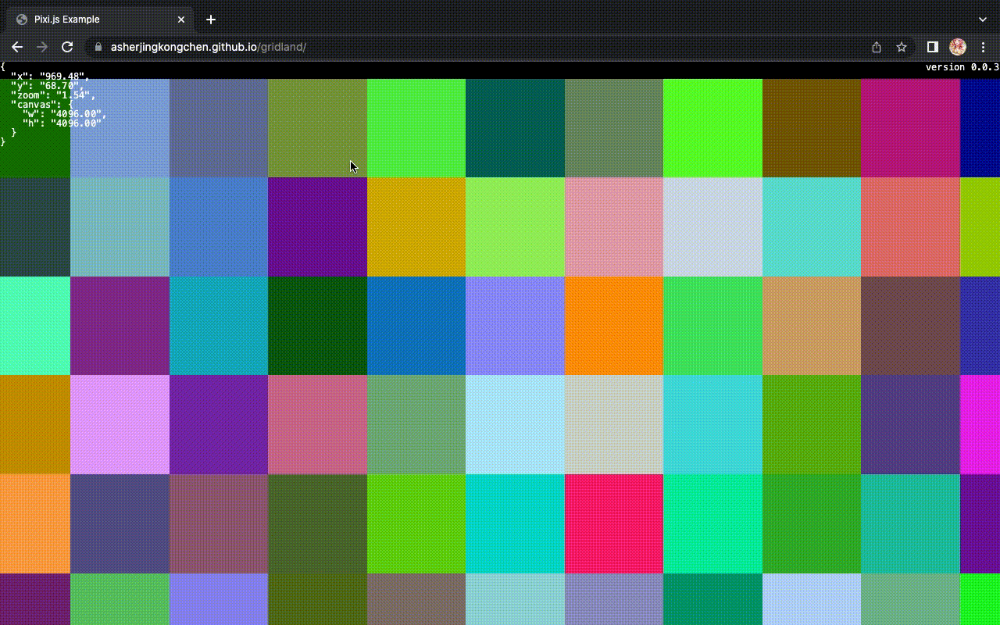
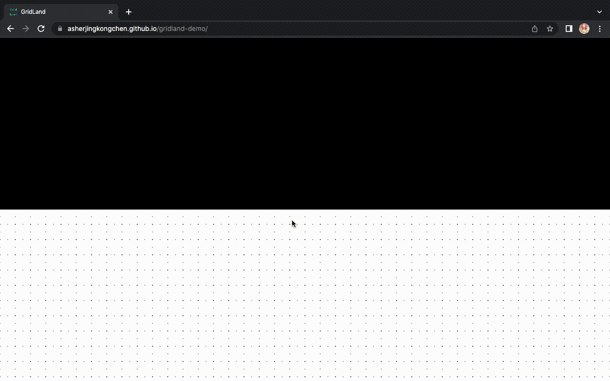

# Version

[0.0.1](#001)

[0.0.2](#002)

[0.0.3](#003)

[0.0.4](#004)

[0.0.5](#005)

[0.0.6](#006)

## 0.0.1
  - Under development
  - Camera (almost)
  - GIF 

## 0.0.2
  - Refactor and fix bugs on Camera
  - Reduce the usability of Camera but increase its accuracy
  - GIF 

## 0.0.3
  - Observer Pattern is applied
  - StatsPanel, Stats is added
  - GIF 

## 0.0.4
  - StatsPanel and Camera are extended
  - More designs are added: Attachable, Resizable
  - KeyModifierOption is added for managing keyboard inputs
  - GIF 

## 0.0.5
  - Eventable is added with one `event` property
  - Refactored, StatsPanel and Camera is Eventable now
  - Observer pattern is replaced by EventEmitter3 (in PIXI.utils)
  - Real-time update of StatsPanel is true
  - `grid.png` is used for TilingSprite to create large repeating patterns for background
  - GIF 

## 0.0.6
